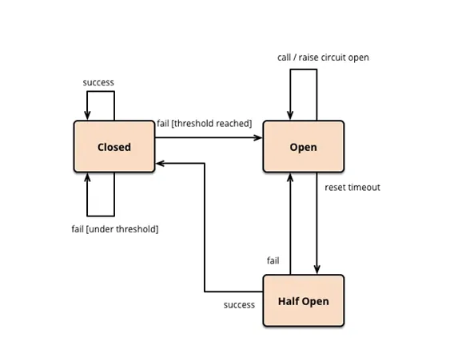

# POC - CIRCUIT BREAKER

Imagem retirada de [ItauTech-Compreendendo o conceito de Circuit Breaker...](https://medium.com/itautech/compreendendo-o-conceito-de-circuit-breaker-e-sua-aplica%C3%A7%C3%A3o-em-arquitetura-de-microsservi%C3%A7os-108dc2d1be2c)
 
## O que é Circuit Breaker?

Trata-se de um padrão de projeto aplicado na arquitetura de um software responsável por lidar com falhas em serviços dependentes, atuando na interrupção da comunicação com o serviço que apresenta alguma intercorrência. 

Podemos entender o mecanismo do circuit breaker comparando com um DR, um tipo de disjuntor que detecta falhas no sistema elétrico (sobrecargas e curto-circuitos). O DR, ao detectar um problema elétrico aciona o desligamento e fornecimento de energia para que nenhum outro dispositivo seja danificado e proteja as pessoas de um choque elétrico. 

#### Voltando...
O Circuit Breaker, também chamado de sistema fechado, possui 3 estados: **Fechado (Closed), Aberto (Open) e Meio aberto (Half Open).**

### Estado Fechado
Ele inicia no estado **Fechado**, permitindo que todas as requisições ocorram sem anormalidades. As requisições entre serviços são monitoradas, e com um número de falhas alcançado (threshold) o sistema abre o circuito, mudando para o estado **Aberto**.

### Estado Aberto
Quando o sistema está atuando nesse estado, significa que alguma intercorrência foi identificada no serviço dependente. Logo, deverá ser informado na resposta à requisição que o serviço encontra-se indisponível no momento (por meio de uma mensagem de erro ou resposta predefinida). 

Portanto, evitaremos que o serviço com instabilidade tenha uma sobrecarga de requisições.

### Estado Meio Aberto
Dado um período que especificaremos, o sistema acionará o estado **Meio Aberto**, que permitirá que um número limitado de requisições sejam enviados para o serviço. As requisições serão então monitoradas, dependendo do resultado das respostas o sistema irá acionar o estado de **Fechado** se obtiverem resposta de sucesso. Caso contrário, o sistema voltará ao estado **Aberto**, pois identificará que o serviço continua indisponível.

### Implementação do Circuit Breaker com pybreaker
Nesse projeto trabalhamos com a biblioteca [pybreaker](https://pypi.org/project/pybreaker/) para implementação do circuito.
